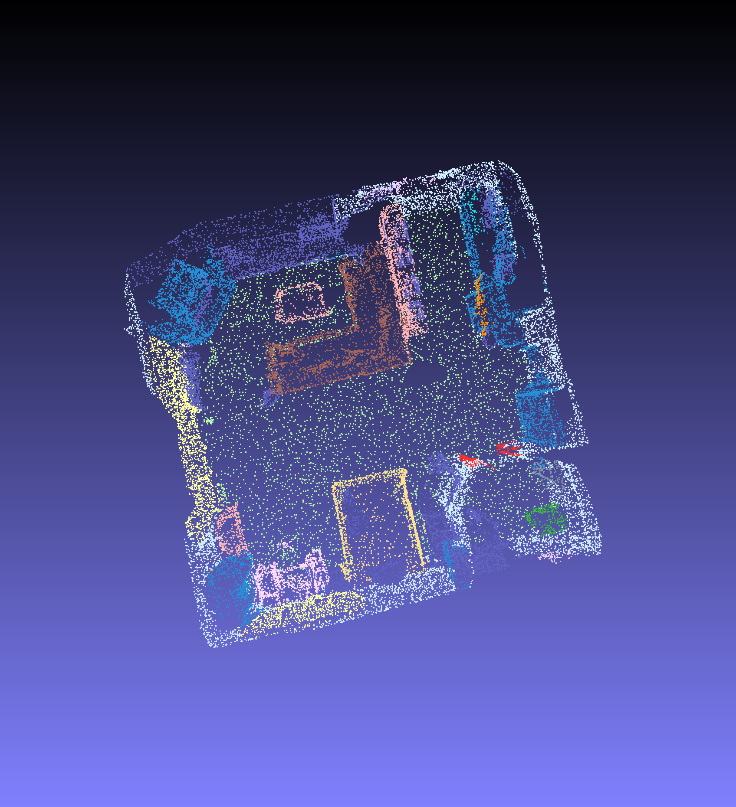

# Install

```bash
cd lib/pointops/
python setup.py install
```

# Usage

## change the path

Before running this code, you must check the path parameters defined in `utils/config.py`.

## preprocess scannet scenes

Parse the ScanNet data into `*.npy` files and save them in `SCANNET_DIR/preprocessing/scannet_scenes/`

```bash
python preprocessing/collect_scannet_scenes.py
```

Note: you can comment line 88 ~ 90 in `preprocessing/collect_scannet_scenes.py` to process all scenes. 

Sanity check: Don't forget to visualize the preprocessed scenes to check the consistency

```bash
python preprocessing/visualize_prep_scene.py --scene_id <scene_id>
```

The visualized `<scene_id>.ply` is stored in `preprocessing/label_point_clouds/` - Drag that file into MeshLab for visualization.

## train

### setting

- train & validate set: scene0000_00 ~ scene0599_00

- test set: scene0600_00 ~ scene0706_00

- use color

- each scene use 32768 points

```bash
python scripts/train_semseg.py --use_color --tag PointTrans_C_32768 --batch_size 24 --epoch 200 --npoint 32768
```

## visualize segmentation results

```bash
python scripts/eval_visualize.py --folder 2022-04-13_18-29-56_POINTTRANS_C_32768 --use_color --npoints 32768 --scene_id scene0654_00
```

The results will be saved in your `CONF.OUTPUT_ROOT` folder. Some results are visualizing as follows:

<center>
 
</center>

## visualize segmentation results of other dataset

1. preprocess the `.ply` format data with `preprocessing/preprocess_pc.py`, converting the mesh to `.npy`

```bash
python ./preprocessing/preprocess_pc.py
```

Note: change the path config, i.e., `scene_dir` and `preprocess_scenes_dir`, or some code to use your own data

2. change the `CONF.SCANNETV2_FILE` in `utils/config.py` to `preprocess_scenes_dir`

3. run the original test code

```bash
python scripts/eval_visualize.py --folder 2022-04-13_18-29-56_POINTTRANS_C_32768 --use_color --npoints 32768 --scene_id scene_name
```

# References

If you use this code, please cite the follow two papers:

```txt
@inproceedings{zhao2021point,
  title={Point transformer},
  author={Zhao, Hengshuang and Jiang, Li and Jia, Jiaya and Torr, Philip HS and Koltun, Vladlen},
  booktitle={Proceedings of the IEEE/CVF International Conference on Computer Vision},
  pages={16259--16268},
  year={2021}
}
```

```txt
@inproceedings{dai2017scannet,
  title={Scannet: Richly-annotated 3d reconstructions of indoor scenes},
  author={Dai, Angela and Chang, Angel X and Savva, Manolis and Halber, Maciej and Funkhouser, Thomas and Nie{\ss}ner, Matthias},
  booktitle={Proceedings of the IEEE conference on computer vision and pattern recognition},
  pages={5828--5839},
  year={2017}
}
```

# Acknowledgements

* [Pointnet2.ScanNet](https://github.com/daveredrum/Pointnet2.ScanNet)

* [point-transformer](https://github.com/POSTECH-CVLab/point-transformer/tree/8d2a38998f1ed8cd6d03fe1b671440724aa269c8)